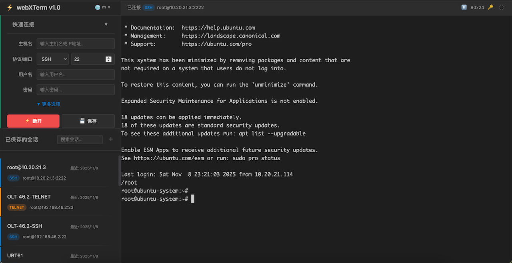

# webXTerm - Modern Web Terminal

A browser-based SSH/Telnet remote terminal management tool providing clean and efficient server remote access and management experience. No client installation required - simply open your browser to connect to remote servers.



## Core Features

- 🔐 **SSH/Telnet Support** - Complete SSH and Telnet protocol implementation
- 💾 **Session Management** - Save connection configs with grouping and quick search
- 🔑 **SSH Key Management** - Centralized SSH key management with upload and paste
- 🔤 **Smart Encoding** - Auto-detect UTF-8/GBK encoding for perfect Chinese display
- 🎨 **Professional UI** - Dark theme, eye-friendly and comfortable
- 🌍 **Multi-language** - Simplified Chinese, Traditional Chinese, English
- 📱 **Responsive Design** - Perfect support for desktop and mobile devices
- ⚡ **High Performance** - Built with FastAPI and XTerm.js

## Main Features

### 1. Quick Connect

- Connect quickly by filling in server information
- Support SSH password and key authentication
- Support Telnet plaintext connection
- Auto-detect server encoding

### 2. Session Management

- **Save Configs**: Store frequently used server connections
- **Group Management**: Organize by project or environment
- **Quick Search**: Real-time search and filter sessions
- **Easy Operations**:
  - Single click → Fill connection form
  - Double click → Direct connect
  - Right-click menu → Edit/Duplicate/Delete

### 3. SSH Key Management

- Centrally manage all SSH private keys
- Support file upload or direct paste
- Display key fingerprint for identification
- Select key from dropdown when connecting
- Encrypted storage for security

### 4. Smart Encoding

Auto-detect and adapt server character encoding:

- **UTF-8**: Modern Linux/Unix systems
- **GBK/GB2312**: Legacy Chinese systems
- **Auto-detect**: Smart recognition without configuration

### 5. Connection Management

- Auto-switch: New connections auto-disconnect old sessions
- Status display: Real-time connection status and info
- Session summary: Display duration and reason on disconnect
- Quick reconnect: One-click reconnect to disconnected sessions

## Technical Architecture

### Backend

- **FastAPI** - Modern Python web framework
- **paramiko** - SSH protocol implementation
- **telnetlib3** - Telnet protocol implementation
- **SQLite** - Data storage
- **uvicorn** - ASGI server

### Frontend

- **XTerm.js 5.5.0** - Terminal emulator
- **Vanilla JavaScript (ES6+)** - No framework dependencies
- **CSS Grid/Flexbox** - Responsive layout

### Data Flow

```
Browser <--WebSocket--> FastAPI <--SSH/Telnet--> Remote Server
   |                       |
XTerm.js             paramiko/telnetlib3
```

## Project Structure

```
webxterm/
├── app/                    # Backend application
│   ├── api/               # API routes
│   ├── core/              # Core configuration
│   ├── models/            # Data models
│   ├── protocols/         # SSH/Telnet implementation
│   └── services/          # Business logic
├── frontend/              # Frontend resources
│   ├── static/
│   │   ├── css/          # Stylesheets
│   │   ├── js/           # JavaScript modules
│   │   └── assets/       # Static assets
│   └── templates/         # HTML templates
├── data/                  # Runtime data
│   ├── webxterm.db       # SQLite database
│   └── webxterm.log      # Application logs
├── start.py              # Startup script
└── requirements.txt      # Python dependencies
```

## Configuration

### Default Settings

- **Listen Address**: 0.0.0.0 (all interfaces)
- **Listen Port**: 8080
- **Data Directory**: ./data/
- **Log Level**: WARNING

### Custom Configuration

Optional `config.json` for customization:

```json
{
  "host": "127.0.0.1",
  "port": 8080,
  "data_dir": "./data",
  "log_level": "INFO"
}
```

## Production Deployment

### Docker Deployment (Recommended)

#### Basic Deployment

```bash
# Method 1: Using Docker Compose (Recommended)
docker-compose up -d

# Method 2: Using Official Image
docker pull nekhama/webxterm:latest
docker run -d \
  --name webxterm \
  -p 8080:8080 \
  -v $(pwd)/data:/app/data \
  --restart unless-stopped \
  nekhama/webxterm:latest
```

#### Data Persistence

The data directory `./data` is mounted via volume and contains:
- `webxterm.db` - SQLite database
- SSH keys and other sensitive data

Regular backups of this directory:

```bash
# Backup data
tar -czf webxterm-backup-$(date +%Y%m%d).tar.gz data/

# Restore data
tar -xzf webxterm-backup-20240101.tar.gz
```

#### Available Images

```bash
# Latest version (Alpine, 117MB)
nekhama/webxterm:latest

# Specific version
nekhama/webxterm:1.0.0

# Docker Hub: https://hub.docker.com/r/nekhama/webxterm
```

### Traditional Daemon Mode

```bash
# Start service
python start.py --daemon --port 8080

# View logs
tail -f data/webxterm.log

# Stop service
python start.py --stop
```

### Reverse Proxy

Recommended using Nginx or Apache as reverse proxy:

```nginx
# Nginx configuration example
server {
    listen 80;
    server_name your-domain.com;

    location / {
        proxy_pass http://127.0.0.1:8080;
        proxy_http_version 1.1;
        proxy_set_header Upgrade $http_upgrade;
        proxy_set_header Connection "upgrade";
        proxy_set_header Host $host;
        proxy_set_header X-Real-IP $remote_addr;
    }
}
```

### Build Custom Image

If you want to modify the code and build your own image:

```bash
# Using Alpine version (Recommended, 117MB)
docker build -f Dockerfile.alpine -t myname/webxterm:latest .

# Using standard version (247MB)
docker build -f Dockerfile -t myname/webxterm:latest .

# Run custom image
docker run -d -p 8080:8080 -v $(pwd)/data:/app/data myname/webxterm:latest
```

### Security Recommendations

- ✅ Configure HTTPS (strongly recommended)
- ✅ Set firewall rules
- ✅ Regular database backups
- ✅ Use strong passwords
- ✅ Enable access logs
- ✅ Restrict source IPs (optional)

## FAQ

### Connection Failed?

1. Check if target server network is reachable
2. Verify SSH/Telnet port is correct
3. Validate username/password or key
4. Check server firewall settings

### Chinese Garbled Text?

- Use "Auto-detect" encoding option
- Or manually select UTF-8 or GBK

### Connection Dropped?

- Check network stability
- Verify server timeout settings
- Use reconnect function for quick recovery

## Dependencies

### Python Dependencies

```
fastapi >= 0.104.0
uvicorn >= 0.24.0
paramiko >= 3.3.0
telnetlib3 >= 2.0.0
python-multipart >= 0.0.6
cryptography >= 41.0.0
```

### Frontend Dependencies

All frontend libraries are hosted locally, no CDN required:

- XTerm.js 5.5.0
- xterm-addon-fit
- @xterm/addon-web-links

## License

MIT License

## Contributing

Issues and Pull Requests are welcome!

## Credits

- [XTerm.js](https://xtermjs.org/) - Powerful terminal component
- [FastAPI](https://fastapi.tiangolo.com/) - Modern web framework
- [paramiko](https://www.paramiko.org/) - Python SSH library
